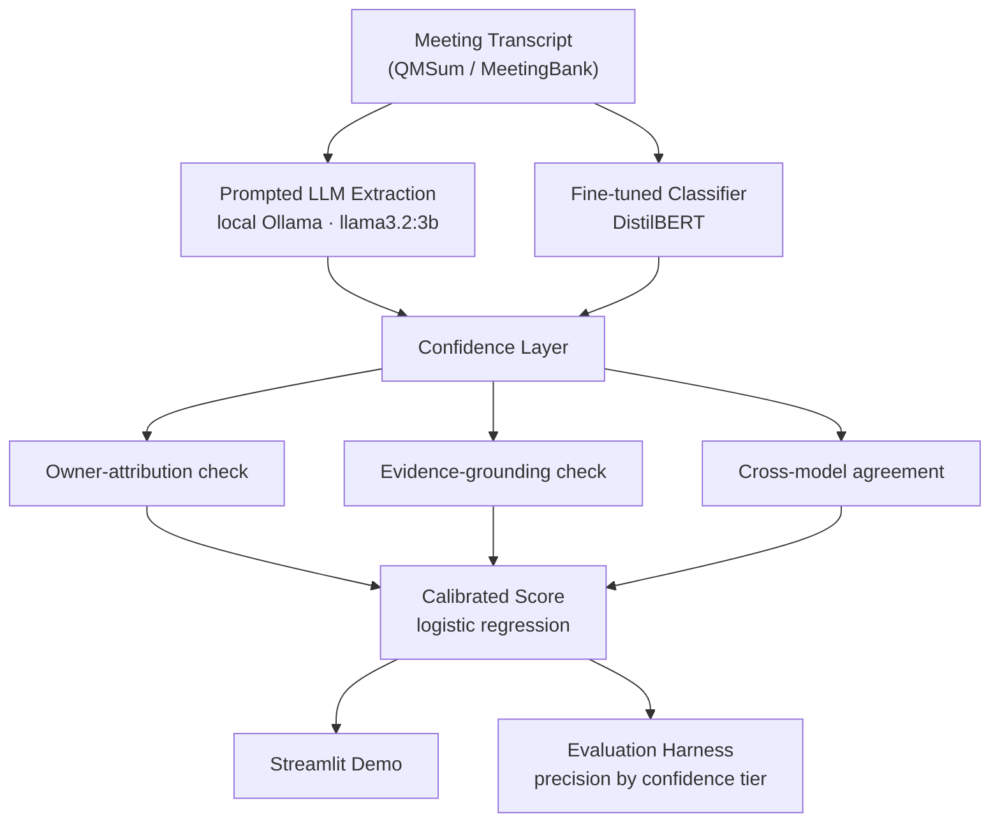

# Confidence-Aware Meeting Intelligence

A meeting-transcript summarizer and action-item extractor that tracks and surfaces *confidence* for every extracted field — instead of presenting every summary and action item with equal, false certainty like existing commercial tools (Otter.ai, Fireflies, Fathom, Gong, etc.).

## Why

Research into commercial AI meeting tools shows that most complaints about "wrong" summaries are actually complaints about upstream transcription/speaker-attribution errors compounding into misattributed action items — and none of these tools tell you *how sure* they are about any given extraction. Action-item accuracy in these tools sits at only 62-87%, with no confidence signal at all.

## Does it actually work?

Yes — validated on genuinely held-out data (never seen during calibration-model training):

| Confidence tier | Precision |
|---|---|
| **Top third** | **58%** |
| Middle third | 32% |
| Bottom third | 16% |
| No filtering (baseline) | 35% |

Filtering to the top third of confidence scores nearly **doubles precision** over doing nothing, and beats the bottom third by **3.6x** — on data the calibration model never trained on, so this isn't overfitting. Full breakdown, plus the secondary ROUGE/BERTScore/LLM-judge signals, in [`reports/evaluation_summary.md`](reports/evaluation_summary.md).

## Architecture



1. **Prompted LLM extraction** — local Ollama model (`llama3.2:3b`), JSON-schema-constrained structured output, zero marginal cost. No paid API dependency: a deliberate constraint (no budget available), not an oversight — see [`docs/architecture.md`](docs/architecture.md).
2. **Fine-tuned classifier baseline** — DistilBERT, binary action-item-sentence classification, trained on weakly-labeled data. The required second arm of the comparison.
3. **Confidence layer** — combines owner-attribution category, evidence-grounding verification, and cross-model agreement between the two arms above into one calibrated score, trained against 228 hand-labeled gold examples.
4. **Hybrid evaluation** — the precision-by-tier result above, plus ROUGE/BERTScore (cheap sanity check only) and LLM-as-judge (secondary signal).

## Try it

```bash
streamlit run app/app.py
```

Bundled sample meetings work offline with no setup. If Ollama is running locally, a "Live extraction" mode also becomes available, scoped to the 20 gold-evaluation meetings.

## Project structure

```
pipeline/       canonical schema + LLM extraction (Ollama) + chunking
classifier/     DistilBERT baseline: weak-label prep, training, inference
confidence/     owner-attribution, grounding, cross-model agreement, calibration
eval/           evaluation harness (precision by tier, ROUGE/BERTScore, LLM-judge)
app/            Streamlit demo + sample meetings for offline browsing
ingestion/      QMSum / MeetingBank -> canonical Transcript schema
scripts/        one-off tools: dataset download, extraction CLI, gold labeling app
docs/           architecture, scope boundaries, labeling guidelines
data/eval_gold/ the hand-labeled gold set (committed - the real artifact)
```

## Setup (from scratch)

```bash
python3 -m venv venv && source venv/bin/activate
pip install -r requirements.txt

# LLM extraction runs against a local Ollama model - no API key needed
brew install ollama && brew services start ollama
ollama pull llama3.2:3b      # ~2GB

# Download and normalize QMSum + MeetingBank
./scripts/download_datasets.sh
python3 ingestion/ingest_qmsum.py
python3 ingestion/ingest_meetingbank.py
python3 ingestion/validate_processed_data.py
python3 ingestion/select_gold_meetings.py

# Run the extraction pipeline across the gold set (both arms)
python3 classifier/prepare_training_data.py
python3 classifier/train.py
python3 eval/run_batch_extraction.py --meeting-ids data/eval_gold/selected_meetings.txt

# Gold-set labeling is already done (data/eval_gold/labeling_sheet.csv is committed);
# to redo it from scratch: python3 eval/export_labeling_sheet.py, then
# streamlit run scripts/labeling_app.py

# Train the confidence calibration model and reproduce the evaluation
python3 confidence/calibration_model.py
python3 eval/action_item_prf.py
python3 eval/run_summary_metrics.py

# Try the demo
streamlit run app/app.py
```

## Honest limitations

Disclosed here rather than buried, consistent with the project's own premise:

- **No paid API** — the "prompted LLM extraction" arm runs on a small local model (`llama3.2:3b`, chosen for an 8GB-RAM machine), not a frontier model. It makes more mistakes than Claude/GPT would; the evaluation measures this honestly rather than hiding it.
- **No ASR/diarization** — starts from existing transcripts (QMSum, MeetingBank), not raw audio. Upstream transcription error is treated as a given condition to model confidence around, not solved directly.
- **Small gold set** — 228 hand-labeled items, ~19 per tier on the held-out split. Real signal (the precision-by-tier pattern replicates across held-out and full-set evaluations), but a small sample.
- **Labeling was suggestion-assisted** — a stability recheck during labeling caught real anchoring (some early labels had just matched a heuristic suggestion without close review) and fixed it, but single-annotator labeling with any assistance carries some residual risk versus fully independent judgment.
- **LLM-as-judge self-evaluates** — the same local model that generates summaries also judges them (no separate model available). Treated as a weak secondary signal throughout, never the validating result.

## License

MIT - see [`LICENSE`](LICENSE).
